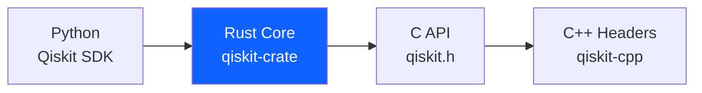
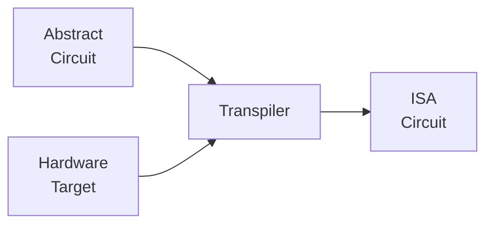
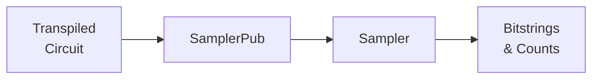

# From Qiskit Python to C++
### Building quantum programs with the qiskit-cpp SDK

> IBM Quantum Workshop — 2026

<!-- NOTES: Welcome everyone. This workshop assumes familiarity with Qiskit in Python. We'll systematically translate that knowledge into C++. -->

---

## Why C++ for Quantum Computing?

- **Quantum Centric Supercomputing** — C/C++ is the lingua franca of HPC
- **Performance** — tight integration with MPI, simulation frameworks, and scientific codes
- **Latency-critical loops** — classical feedback with minimal overhead
- **Deployment** — no Python runtime dependency for embedded or production systems
- **Existing codebases** — bring quantum into C++ applications without a language switch

> C++ gives you the same Qiskit transpiler and primitives — without the Python interpreter.

<!-- NOTES: Emphasize that this is NOT about replacing Python. It's about reaching developers where they already are. -->

---

## The Architecture



- The **Rust core** powers both Python and C/C++ — same transpiler, same compiler
- The **C API** (`qiskit.h`) is shipped inside the pip package since Qiskit 2.4
- **qiskit-cpp** is a header-only C++ wrapper over the C API

> One engine. Multiple language bindings. Identical results.

<!-- NOTES: This is key — we're not reimplementing Qiskit in C++. The Rust core does the heavy lifting everywhere. -->

---

## What qiskit-cpp Provides

Seven modules that mirror the Python SDK:

| Module | Purpose |
|--------|---------|
| `circuit` | QuantumCircuit, registers, gates, Parameters |
| `compiler` | `transpile()` convenience function |
| `primitives` | Sampler (BackendSamplerV2) |
| `providers` | Job, BackendV2 |
| `quantum_info` | SparseObservable |
| `service` | QiskitRuntimeService |
| `transpiler` | Target, generate_preset_pass_manager |

- **Header-only** — no compilation of qiskit-cpp itself
- **C++11** compatible — works with GCC, Clang, MSVC

<!-- NOTES: Header-only means you just point your include path at the src/ directory. No library to build. -->

---

## Good News for Python Developers

The APIs are **nearly identical**. Here's a GHZ circuit in both:

| Python | C++ |
|--------|-----|
| `from qiskit import QuantumCircuit` | `#include "circuit/quantumcircuit.hpp"` |
| `qc = QuantumCircuit(5, 5)` | `QuantumCircuit circ(qr, cr);` |
| `qc.h(0)` | `circ.h(0);` |
| `for i in range(4):` | `for (int i = 0; i < 4; i++) {` |
| `    qc.cx(i, i+1)` | `    circ.cx(i, i+1);` |
| `qc.measure(range(5), range(5))` | `circ.measure(qr, cr);` |

> The main differences are type declarations, semicolons, and explicit registers.

<!-- NOTES: Reassure the audience — if you know Qiskit Python, you already know 90% of the C++ API. -->

---

## Workshop Roadmap

1. **Setup** — install Qiskit 2.4, clone qiskit-cpp, configure CMake
2. **First Circuit** — hello world, side-by-side
3. **Gates Tour** — single-qubit, multi-qubit, rotations
4. **Bell & GHZ** — classic circuits with loops
5. **Parameters** — symbolic parameters and binding
6. **Observables** — SparseObservable construction
7. **Composition** — building circuits from sub-circuits
8. **Transpilation** — `generate_preset_pass_manager` with a real backend
9. **Sampling** — end-to-end execution on hardware
10. **Wrap-Up** — cheat sheet and resources

> Examples 01–07 run locally. Examples 08–09 require IBM Quantum credentials.

---

## Prerequisites

Before we start, you'll need:

- [x] **C++11 compiler** — `g++` or `clang++`
- [x] **CMake** 3.11 or later
- [x] **Python** 3.9 or later with `pip`
- [ ] (Optional) **IBM Quantum account** for hardware examples

Verify your tools:

```bash
g++ --version        # or clang++ --version
cmake --version
python3 --version
```

> **Apple Silicon Macs:** Your tools must be arm64, not x86_64. Check with `file $(which cmake)`. If it shows x86_64, install the native arm64 Homebrew and cmake, then add it to your PATH:

```bash
# Install arm64 Homebrew (one-time, if not already at /opt/homebrew)
/bin/bash -c "$(curl -fsSL https://raw.githubusercontent.com/Homebrew/install/HEAD/install.sh)"

# Install arm64 cmake
/opt/homebrew/bin/brew install cmake

# Add to PATH (add this line to ~/.zshrc to make permanent)
export PATH="/opt/homebrew/bin:$PATH"
```

<!-- NOTES: Pause here. Let everyone confirm their compilers are working. The Apple Silicon issue is subtle — an x86_64 cmake will launch x86_64 Python, which can't load arm64 Qiskit .so files. If anyone has issues, check file $(which cmake) and file $(which python3). -->

---

## Step 1: Install Qiskit 2.4

```bash
python3 -m pip install "qiskit>=2.4.0rc1"
```

Since Qiskit 2.4, the **C header and shared library** are bundled in the pip package. No more `git clone qiskit && make c`.

Discover the paths:

```bash
python3 -c "import qiskit.capi; print(qiskit.capi.get_include())"
# → /path/to/site-packages/qiskit/capi/include

python3 -c "import qiskit.capi; print(qiskit.capi.get_lib())"
# → /path/to/site-packages/qiskit/_accelerate.abi3.so
```

> These two paths are all CMake needs to link your C++ code against Qiskit.

---

## Step 2: Get the qiskit-cpp Headers

Clone qiskit-cpp as a **sibling** of your project directory (one-time setup):

```bash
cd ..
git clone https://github.com/Qiskit/qiskit-cpp.git
cd from-qiskit-python-to-cpp
```

Your directory layout should look like:

```
parent-folder/
├── from-qiskit-python-to-cpp/   # your project
└── qiskit-cpp/                  # cloned here
    └── src/                     # header-only include path
```

qiskit-cpp is **header-only** — the `src/` directory IS the include path. No compilation step. This single clone works for any C++ project that uses Qiskit.

<!-- NOTES: This is a one-time setup. The CMakeLists.txt defaults to ../qiskit-cpp/src so it finds the headers automatically. -->

---

## Step 3: Build with CMake

```bash
cd examples
mkdir build && cd build
cmake ..
make
```

If you cloned qiskit-cpp as a sibling directory (Step 2), CMake finds it automatically. Otherwise, pass the path explicitly:

```bash
cmake -DQISKIT_CPP_SRC=/path/to/qiskit-cpp/src ..
```

CMake auto-discovers Qiskit C API paths from pip and links the Python library — no manual configuration needed.

> If `cmake` fails on Apple Silicon, use the arm64 build: `/opt/homebrew/bin/cmake ..`

---

## Step 4: (Optional) Hardware Examples Setup

Examples 08 and 09 require **QRMI** (Qiskit Remote Machine Interface) and an IBM Quantum account.

### Install QRMI

Requires: Rust 1.91+ (`rustc`, `cargo`).

```bash
cd ../..                # parent directory (alongside qiskit-cpp)
git clone https://github.com/qiskit-community/qrmi.git
cd qrmi
cargo build --locked --release
cd ../from-qiskit-python-to-cpp
```

Your directory layout should now look like:

```
parent-folder/
├── from-qiskit-python-to-cpp/
├── qiskit-cpp/
└── qrmi/
```

### Configure credentials

Set via environment variables:

```bash
export QISKIT_IBM_TOKEN="your-api-key"
export QISKIT_IBM_INSTANCE="your-crn"
```

Or save to `~/.qiskit/qiskit-ibm.json`:

```json
{
  "ibm_quantum": {
    "token": "your-api-key",
    "instance": "your-crn"
  }
}
```

### Build the hardware examples

```bash
cmake -DENABLE_HARDWARE_EXAMPLES=ON ..
make
```

> Examples 01–07 work entirely offline. Examples 08–09 use QRMI, the same interface used by the official qiskit-cpp samples.

---

## Example 01: Hello Circuit

### Python

```python
from qiskit import QuantumCircuit

qc = QuantumCircuit(2, 2)
qc.h(0)
qc.cx(0, 1)
qc.measure([0, 1], [0, 1])

print(qc)
print(qc.qasm())
```

### C++

```cpp
#include "circuit/quantumcircuit.hpp"
using namespace Qiskit::circuit;

int main() {
    QuantumRegister qr(2);
    ClassicalRegister cr(2);
    QuantumCircuit circ(qr, cr);

    circ.h(0);
    circ.cx(0, 1);
    circ.measure(0, 0);
    circ.measure(1, 1);

    circ.print();
    std::cout << circ.to_qasm3() << std::endl;
    return 0;
}
```

<!-- NOTES: Walk through line-by-line. Highlight the structural differences. -->

---

## Anatomy: What's Different

| Concept | Python | C++ |
|---------|--------|-----|
| Import | `from qiskit import QuantumCircuit` | `#include "circuit/quantumcircuit.hpp"` |
| Namespace | Implicit | `using namespace Qiskit::circuit;` |
| Circuit creation | `QuantumCircuit(2, 2)` | `QuantumCircuit circ(qr, cr);` |
| Registers | Implicit (integers) | Explicit objects: `QuantumRegister`, `ClassicalRegister` |
| Gate calls | `qc.h(0)` | `circ.h(0);` — identical |
| Semicolons | No | Yes |
| Entry point | Script runs top-down | `int main() { ... }` |

> Gate method names are **identical** — `h()`, `cx()`, `rx()`, `measure()`, etc.

---

## Key Difference: Registers

**Python** — integers create implicit registers:

```python
qc = QuantumCircuit(2, 2)   # 2 qubits, 2 classical bits
```

**C++** — explicit register objects:

```cpp
QuantumRegister qr(2);
ClassicalRegister cr(2);
QuantumCircuit circ(qr, cr);
```

Named registers for result access:

```cpp
ClassicalRegister cr(2, std::string("meas"));
// Later: pub_result.data("meas")
```

> Named registers become important when processing Sampler results.

---

## Output Methods

| Python | C++ | Description |
|--------|-----|-------------|
| `print(qc)` | `circ.print()` | Text representation |
| `qc.draw()` | `circ.draw()` | ASCII visualization |
| `qc.qasm()` | `circ.to_qasm3()` | OpenQASM 3 export |

```cpp
circ.print();
std::cout << std::endl;
std::cout << circ.to_qasm3() << std::endl;
```

### Checkpoint

```bash
cd build && ./hello_circuit
```

<!-- NOTES: Have everyone build and run. Wait for all to see output before continuing. -->

---

## Example 02: Single-Qubit Gates

Gate method names are **identical** between Python and C++:

| Gate | Python | C++ |
|------|--------|-----|
| Hadamard | `qc.h(0)` | `circ.h(0);` |
| Pauli-X | `qc.x(1)` | `circ.x(1);` |
| Pauli-Y | `qc.y(2)` | `circ.y(2);` |
| Pauli-Z | `qc.z(3)` | `circ.z(3);` |
| S gate | `qc.s(0)` | `circ.s(0);` |
| T gate | `qc.t(1)` | `circ.t(1);` |

> If you can write `qc.h(0)` in Python, you can write `circ.h(0);` in C++.

---

## Rotation Gates

Rotation gates take a `double` angle parameter:

### Python

```python
import math
qc.rx(math.pi / 4, 0)
qc.ry(math.pi / 3, 1)
qc.rz(math.pi / 2, 2)
```

### C++

```cpp
#include <cmath>
circ.rx(M_PI / 4, 0);
circ.ry(M_PI / 3, 1);
circ.rz(M_PI / 2, 2);
```

Also available: `p()` (phase), `u()` (general single-qubit unitary).

---

## Multi-Qubit Gates

| Gate | Python | C++ |
|------|--------|-----|
| CNOT | `qc.cx(0, 1)` | `circ.cx(0, 1);` |
| CZ | `qc.cz(2, 3)` | `circ.cz(2, 3);` |
| SWAP | `qc.swap(0, 2)` | `circ.swap(0, 2);` |
| Toffoli | `qc.ccx(0, 1, 2)` | `circ.ccx(0, 1, 2);` |
| ECR | `qc.ecr(0, 1)` | `circ.ecr(0, 1);` |

Barriers:

```python
qc.barrier()           # Python
```

```cpp
circ.barrier({0, 1, 2, 3});  // C++ — specify qubits
```

---

## Example 03: Bell State

### Python

```python
qc = QuantumCircuit(2, 2)
qc.h(0)
qc.cx(0, 1)
qc.measure([0, 1], [0, 1])
```

### C++

```cpp
QuantumRegister qr(2);
ClassicalRegister cr(2);
QuantumCircuit circ(qr, cr);

circ.h(0);
circ.cx(0, 1);
circ.measure(0, 0);
circ.measure(1, 1);
```

> The Bell state circuit is essentially identical in both languages.

---

## Example 04: GHZ Circuit with Loops

### Python

```python
n = 5
qc = QuantumCircuit(n, n)
qc.h(0)
for i in range(n - 1):
    qc.cx(i, i + 1)
qc.measure(range(n), range(n))
```

### C++

```cpp
const int n = 5;
QuantumRegister qr(n);
ClassicalRegister cr(n);
QuantumCircuit circ(qr, cr);

circ.h(0);
for (int i = 0; i < n - 1; i++) {
    circ.cx(i, i + 1);
}
circ.measure(qr, cr);
```

> This is where C++ programmers feel at home — standard for-loops, no magic.

### Checkpoint

```bash
./bell_state && ./ghz_circuit
```

---

## Example 05: Parameters

### Python

```python
from qiskit.circuit import Parameter

theta = Parameter('theta')
phi = Parameter('phi')

qc.h(0)
qc.rx(theta, 0)
qc.ry(phi, 1)
qc.cx(0, 1)
```

### C++

```cpp
Parameter theta("theta");
Parameter phi("phi");

circ.h(0);
circ.rx(theta, 0);
circ.ry(phi, 1);
circ.cx(0, 1);
```

> Parameter creation is nearly identical. The constructor takes a string name.

---

## Parameter Expressions

C++ supports arithmetic on Parameters through operator overloading:

```cpp
Parameter theta("theta");
Parameter a = theta + 0.5;    // Parameter expression
circ.rx(a, 1);
```

Python equivalent:

```python
theta = Parameter('theta')
a = theta + 0.5               # ParameterExpression
qc.rx(a, 1)
```

> Same semantics, same operator. C++ uses operator overloading under the hood.

---

## Binding Parameters

### Python

```python
bound = qc.assign_parameters({theta: math.pi/4, phi: math.pi/3})
```

### C++

```cpp
circ.assign_parameters(
    {"theta", "phi"},
    {M_PI / 4, M_PI / 3}
);
```

**Key difference:** Python uses a dict mapping Parameter objects to values. C++ uses two parallel vectors — names and values.

### Checkpoint

```bash
./parameterized
```

<!-- NOTES: Point out that C++ modifies the circuit in place, while Python returns a new circuit by default. -->

---

## Example 06: Observables

### Python

```python
from qiskit.quantum_info import SparsePauliOp

obs = SparsePauliOp.from_list([
    ("IIXY", 1.0),
    ("ZZII", -0.5)
])
```

### C++

```cpp
#include "quantum_info/sparse_observable.hpp"
using namespace Qiskit::quantum_info;

std::vector<std::pair<std::string, std::complex<double>>> terms;
terms.push_back({"IIXY", {1.0, 0.0}});
terms.push_back({"ZZII", {-0.5, 0.0}});
auto obs = SparseObservable::from_list(terms);
```

> C++ is more verbose here due to explicit types, but the concept is identical.

---

## Observable Factory Methods

| Method | C++ | Description |
|--------|-----|-------------|
| Zero | `SparseObservable::zero(n)` | Zero observable on n qubits |
| Identity | `SparseObservable::identity(n)` | Identity on n qubits |
| From label | `SparseObservable::from_label("IXYZ")` | From Pauli string |
| From list | `SparseObservable::from_list(terms)` | From coefficient pairs |

Arithmetic operators work:

```cpp
auto a = SparseObservable::zero(4);
auto b = SparseObservable::identity(4);
a += b;   // operator overloading
```

### Checkpoint

```bash
./observables
```

---

## Example 07: Circuit Composition

### Python

```python
sub = QuantumCircuit(2, 2)
sub.cz(0, 1)
sub.ry(1.57, 0)

composed = qc.compose(sub, qubits=[2, 3], clbits=[2, 3])
```

### C++

```cpp
QuantumCircuit sub(sub_qr, sub_cr);
sub.cz(0, 1);
sub.ry(1.57, 0);

circ.compose(sub, {2, 3}, {2, 3});
```

The second and third arguments map the sub-circuit's qubits and classical bits onto the main circuit.

> `compose()` works the same way — map sub-circuit wires onto the parent circuit.

### Checkpoint

```bash
./compose_append
```

---

## What is Transpilation?



Transpilation converts your abstract circuit into one that:

- Uses only gates the hardware supports (e.g., CX, RZ, SX)
- Respects the qubit connectivity (coupling map)
- Is optimized for depth and gate count

> The same Rust transpiler runs whether you call it from Python or C++.

---

## Understanding `generate_preset_pass_manager`

`generate_preset_pass_manager` is the unified transpilation API in both Python and C++. It accepts several overloads:

### From a backend (most common)

```cpp
auto pm = generate_preset_pass_manager(2, backend);
auto transpiled = pm.run(circ);
```

### From basis gates and coupling map

```cpp
auto pm = generate_preset_pass_manager(
    2,
    std::vector<std::string>{"h", "cx"},
    std::vector<std::pair<uint32_t, uint32_t>>{
        {0,1}, {1,0}, {1,2}, {2,1}, {2,3}, {3,2}
    }
);
```

### From a Target object

```cpp
auto pm = generate_preset_pass_manager(2, target);
```

The returned pass manager runs these stages internally: init, layout, routing, translation, optimization, scheduling.

> One function, multiple overloads — pass a backend for production, or basis gates + coupling map for offline testing.

---

## Example 08: Transpilation

### Python

```python
from qiskit.transpiler.preset_passmanagers import (
    generate_preset_pass_manager,
)
from qiskit_ibm_runtime import QiskitRuntimeService

service = QiskitRuntimeService()
backend = service.backend("ibm_torino")
pm = generate_preset_pass_manager(optimization_level=2, backend=backend)
transpiled = pm.run(qc)
```

### C++

```cpp
#include "transpiler/preset_passmanagers/generate_preset_pass_manager.hpp"
#include "service/qiskit_runtime_service.hpp"

auto service = Qiskit::service::QiskitRuntimeService();
auto backend = service.backend("ibm_torino");
auto pm = generate_preset_pass_manager(2, backend);
auto transpiled = pm.run(circ);
```

> Same function name, same pattern. Requires IBM Quantum credentials.

### Checkpoint

```bash
cmake -DENABLE_HARDWARE_EXAMPLES=ON .. && make
./transpile
```

---

## The Primitives Model

Qiskit V2 primitives provide two core operations:

| Primitive | Input | Output |
|-----------|-------|--------|
| **Sampler** | Circuit | Bitstring samples |
| **Estimator** | Circuit + Observable | Expectation values |

qiskit-cpp currently provides `BackendSamplerV2` (aliased as `Sampler`).



---

## Example 09: Full End-to-End

### Python

```python
from qiskit_ibm_runtime import SamplerV2

pm = generate_preset_pass_manager(optimization_level=2, backend=backend)
transpiled = pm.run(qc)

sampler = SamplerV2(backend)
job = sampler.run([transpiled], shots=100)
result = job.result()
counts = result[0].data.c.get_counts()
```

### C++

```cpp
#include "transpiler/preset_passmanagers/generate_preset_pass_manager.hpp"
#include "primitives/backend_sampler_v2.hpp"

auto pm = generate_preset_pass_manager(2, backend);
auto transpiled = pm.run(circ);

auto sampler = BackendSamplerV2(backend, 100);
auto job = sampler.run({SamplerPub(transpiled)});
auto result = job->result();

auto pub_result = result[0];
auto meas_data = pub_result.data("meas");
auto counts = meas_data.get_counts();
```

<!-- NOTES: Walk through each line. Highlight the SamplerPub wrapper and the data() accessor. -->

---

## SamplerPub: Wrapping Circuits

A **Pub** (Primitive Unified Bloc) wraps a circuit for submission:

```cpp
// Single circuit
auto pub = SamplerPub(transpiled_circuit);

// Submit one or more pubs
auto result = sampler.run({pub1, pub2, pub3});
```

Python equivalent:

```python
result = sampler.run([circuit1, circuit2, circuit3])
```

> In C++, explicitly wrap each circuit in a `SamplerPub`. In Python, the list does this implicitly.

---

## Processing Results

Access results by classical register name:

```cpp
auto pub_result = result[0];
auto meas_data = pub_result.data("meas");

// Get all bitstrings
auto bitstrings = meas_data.get_bitstrings();

// Get counts (bitstring → frequency)
auto counts = meas_data.get_counts();

for (auto& kv : counts) {
    std::cout << kv.first << ": " << kv.second << std::endl;
}
```

Python:

```python
pub_result = result[0]
counts = pub_result.data.meas.get_counts()
for bitstring, count in counts.items():
    print(f"{bitstring}: {count}")
```

---

## Named Registers Matter

The register name you choose determines how you access results:

```cpp
// At circuit creation:
ClassicalRegister cr(2, std::string("meas"));

// At result access:
auto data = pub_result.data("meas");
```

If you use multiple classical registers:

```cpp
ClassicalRegister test_cr(1, std::string("test"));
ClassicalRegister meas_cr(3, std::string("meas"));

// Access each independently:
auto test_data = pub_result.data("test");
auto meas_data = pub_result.data("meas");
```

### Checkpoint

```bash
./sampler
```

<!-- NOTES: This requires credentials and a live backend. If people don't have credentials, show the expected output on screen. -->

---

## Python-to-C++ Translation Cheat Sheet

| Concept | Python | C++ |
|---------|--------|-----|
| **Import** | `from qiskit import QuantumCircuit` | `#include "circuit/quantumcircuit.hpp"` |
| **Namespace** | *(implicit)* | `using namespace Qiskit::circuit;` |
| **Circuit** | `QuantumCircuit(n, m)` | `QuantumCircuit circ(qr, cr);` |
| **Gates** | `qc.h(0)` | `circ.h(0);` |
| **Measure** | `qc.measure([0,1], [0,1])` | `circ.measure(qr, cr);` |
| **Parameter** | `Parameter('t')` | `Parameter t("t");` |
| **Bind** | `qc.assign_parameters({t: 1.57})` | `circ.assign_parameters({"t"}, {1.57});` |
| **Transpile** | `generate_preset_pass_manager(backend=backend)` | `generate_preset_pass_manager(2, backend)` |
| **Sampler** | `SamplerV2(backend)` | `BackendSamplerV2(backend, shots)` |
| **Run** | `sampler.run([qc]).result()` | `sampler.run({SamplerPub(circ)})->result()` |
| **Counts** | `result[0].data.c.get_counts()` | `result[0].data("meas").get_counts()` |

---

## When to Use C++ vs Python

| Use C++ when... | Use Python when... |
|----------------|-------------------|
| Integrating with HPC codes (MPI, OpenMP) | Prototyping and exploring ideas |
| Latency-critical classical feedback | Visualization and plotting |
| Deploying without Python runtime | Using Qiskit ecosystem tools |
| Existing C++ scientific codebase | Jupyter notebooks and teaching |
| Embedded or resource-constrained systems | Rapid iteration and debugging |

> **They're not competing** — use Python to prototype, C++ to deploy.

---

## Resources

- **qiskit-cpp SDK**: [github.com/Qiskit/qiskit-cpp](https://github.com/Qiskit/qiskit-cpp)
- **Qiskit C API docs**: [quantum.cloud.ibm.com/docs/en/api/qiskit-c](https://quantum.cloud.ibm.com/docs/en/api/qiskit-c)
- **Qiskit documentation**: [docs.quantum.ibm.com](https://docs.quantum.ibm.com)
- **IBM Quantum Platform**: [quantum.cloud.ibm.com](https://quantum.cloud.ibm.com)
- **QRMI**: [github.com/qiskit-community/qrmi](https://github.com/qiskit-community/qrmi)

Install Qiskit with C API:

```bash
python3 -m pip install "qiskit>=2.4.0rc1"
```

---

## Thank You

> Questions?

<!-- NOTES: Open the floor for questions. Have the cheat sheet slide ready to scroll back to. -->
